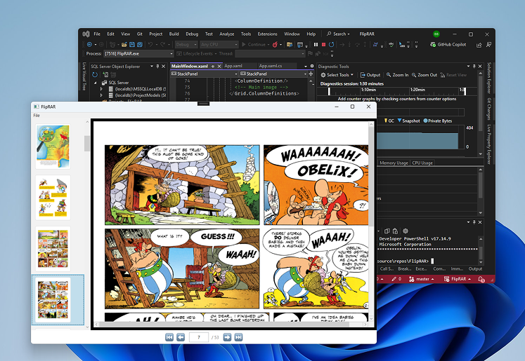

# FlipRAR

FlipRAR is a minimal Windows desktop application built with **WPF (.NET)** that lets you view comic book or image-based archive files with a thumbnail sidebar and a main page display.



---

## Features
- Thumbnail sidebar � scrollable list of all pages for quick navigation.
- Main page display � displays the selected page in detail.
- Simple navigation � easily switch between pages.
- Basic menu structure � file menu placeholder for future file operations.

---

## About This Project
As a **.NET Web API developer**, I wanted to explore **Windows desktop app development** using **WPF**.  
This project served as a small experiment to understand:
- WPF layouts (`Grid`, `StackPanel`, `ScrollViewer`).
- Image display and scaling in desktop apps.
- Interaction between UI elements and code-behind.
- Event-driven programming in WPF.

---

## Requirements
- .NET 6.0 or later  
- Visual Studio 2022 (or compatible)

---

## How to Run
1. Clone the repository:
   ```bash
   git clone https://github.com/yourusername/FlipRAR.git
   ```
2. Open the project in Visual Studio.
3. Build and run the project (`F5`).

---

## Future Improvements
- Fit-to-width zoom for page display.
- Drag-to-pan for zoomed-in images.
- Keyboard shortcuts for page navigation.
- Support for additional archive formats.

---

## License
This project is licensed under the MIT License � see the [LICENSE](LICENSE) file for details.
